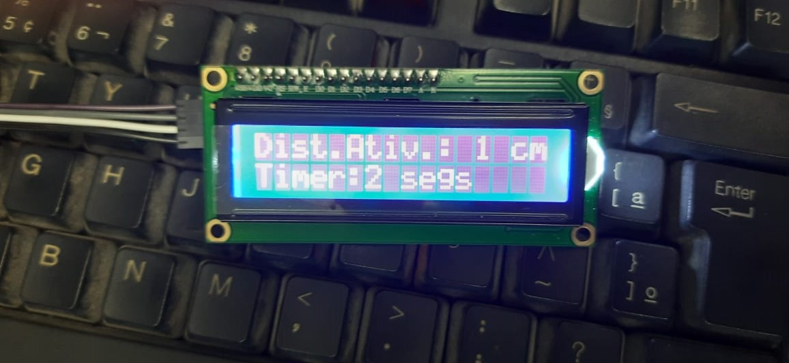
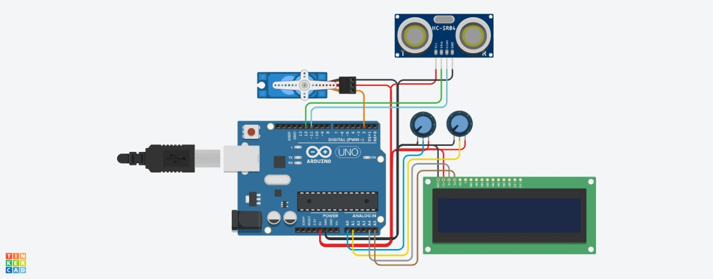

<h1 align="center"> 
 
♻️ Lixeira Inteligente com Arduino Pro Mini
</h1>

 <a href="#-sobre-o-projeto">Sobre</a> | 
 <a href="#-materiais-e-métodos">Materiais e Métodos</a> | 
 <a href="#-prototipação">Prototipação</a> | 
 <a href="#-contribuidores">Contribuidores</a>

## 💻 Sobre o projeto

Este projeto apresenta uma lixeira automatizada utilizando componentes eletrônicos e controle por Arduino, visando facilitar a coleta ou contato direto com lixeira em ambientes hospitalares e também visando a acessibilidade para deficientes físicos. 

Neste contexto, foi realizada a adaptação de uma lixeira convencional, de modo que a mesma pudesse responder por proximidade através de um sensor de ultrassônico de distância, e assim realizar o acionamento da tampa de forma automática por meio do acionamento de um servo motor, abrindo e fechando a lixeira sem a necessidade de contato com a mesma e com a possibilidade de ajustar a distância mínima para acionamento e o tempo que a lixeira ficará aberta através de dois potenciômetros. Muitas vezes se faz útil um dispositivo que evita o contato físico do usuário com o objeto, seja por limitações físicas, higiene e dentre outros motivos. 

Desta forma, visando solucionar este problema, uma lixeira automatizada proporciona os meios necessários para que se faça abertura da tampa sem necessidade de contato físico. Além desta aplicação, também pode-se utilizar em ambientes hospitalares, visando evitar o contato dos profissionais com a lixeira, evitando assim, a contaminação ou transmissão de qualquer tipo de bactéria ou vírus. Os resultados esperados com o protótipo foram satisfatórios.

**Objetivos Específicos**
- Desenvolver uma lixeira eletrônica interativa;
- Acessibilidade para deficientes físicos;
- Dispositivo que evita o contato físico do usuário.

## 🛠 Materiais e Métodos:

- 1 Balde;

## 🎨 Prototipação:

## 👨‍💻 Contribuidores

<table>
  <tr>
   <td align="center"><a href="#"> <b>Benuá Gomes</b></a> </td>🚀</a></td>
   <td align="center"><a href="#"> <b>Camila Modesto</b></a> </td>
   <td align="center"><a href="#"> <b>Clenildo Ferreira</b></a> </td>
   <td align="center"><a href="#"> 
    <b>Italo Azevedo</b></a> </td>
  </tr>
  <tr>
   <td align="center"><a href="#"> <b>Janderson Endryo</b></a> </td>
   <td align="center"><a href="#"> <b>Jayron Castro</b></a> </td>
   <td align="center"><a href="#"> <b>Matheus Sipauba</b></a> </td>
   <td align="center"><a href="#"> <b>Pedro Igor</b></a> </td>
  </tr>
</table>

Este projeto foi desenvolvido durante a disciplina de Projeto de Extensão - FADAM.
