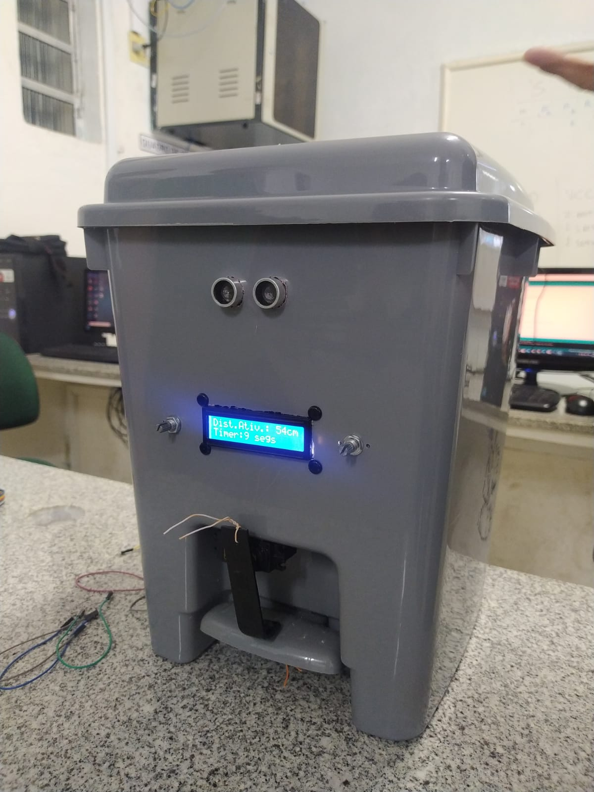

<h1 align="center"> 
 
♻️ Lixeira Inteligente com Arduino Pro Mini
</h1>


 - <a href="#-sobre-o-projeto">Sobre o Projeto</a>
 - <a href="#-materiais-e-métodos">Materiais e Métodos</a>
 - <a href="#-código-de-controle">Código de Controle</a>
 - <a href="#-apresentação-e-análise-de-resultados">Apresentação e análise de resultados</a>
 - <a href="#-desempenho-e-limitações">Desempenho e Limitações</a>
 - <a href="#-contribuidores">Contribuidores</a>
 - <a href="#-referências">Referências</a>
 - <a href="#-conclusão">Conclusão</a>


## 💻 Sobre o Projeto

Este projeto apresenta uma lixeira automatizada utilizando componentes eletrônicos e controle por Arduino, visando facilitar a coleta ou contato direto com lixeira em ambientes hospitalares e também visando a acessibilidade para deficientes físicos. 

Neste contexto, foi realizada a adaptação de uma lixeira convencional, de modo que a mesma pudesse responder por proximidade através de um sensor de ultrassônico de distância, e assim realizar o acionamento da tampa de forma automática por meio do acionamento de um servo motor, abrindo e fechando a lixeira sem a necessidade de contato com a mesma e com a possibilidade de ajustar a distância mínima para acionamento e o tempo que a lixeira ficará aberta através de dois potenciômetros. Muitas vezes se faz útil um dispositivo que evita o contato físico do usuário com o objeto, seja por limitações físicas, higiene e dentre outros motivos. 

Desta forma, visando solucionar este problema, uma lixeira automatizada proporciona os meios necessários para que se faça abertura da tampa sem necessidade de contato físico. Além desta aplicação, também pode-se utilizar em ambientes hospitalares, visando evitar o contato dos profissionais com a lixeira, evitando assim, a contaminação ou transmissão de qualquer tipo de bactéria ou vírus. Os resultados esperados com o protótipo foram satisfatórios.

**Objetivos Específicos**
- Desenvolver uma lixeira eletrônica interativa;
- Acessibilidade para deficientes físicos;
- Dispositivo que evita o contato físico do usuário.

## Referenciais Teóricos
Será dada uma introdução a alguns assuntos importantes para o embasamento deste trabalho. Inicialmente será falado sobre o conceito de internet das coisas e suas possíveis aplicações e depois será descrito o conceito do arduino utilizado. Em seguida, será mostrado a importância de um dispositivo que evita o contato físico, bem como as dificuldades de portador de deficiência física.

**Internet das Coisas:**

Quando nos deparamos com o termo Internet das Coisas, normalmente, vemos a sigla IoT associada. E é bem simples entender o porquê. Internet das Coisas é uma tradução do inglês Internet of Things. Internet das Coisas é uma forma de fazer com que itens do dia a dia sejam capazes de coletar e transmitir dados. O conceito visa proporcionar poder computacional e interconexão a objetos comuns do cotidiano. Os objetos que utilizam a IoT se tornam inteligentes, utilizando computação ubíqua, tecnologias de comunicação e redes de sensores, para a realização de atividades específicas. Isso permite que sejam geradas informações por esses aparelhos, que podem ser enviadas para servidores e com isso pessoas possam tomar decisões.
Para ser considerado um objeto inteligente, isto é, estar inserido no contexto de internet das coisas, o aparelho deve conter algumas características. Essas características estão relacionadas às suas funcionalidades e aplicações. As características que os objetos podem conter são:

- **Processamento:** Responsável pelo poder computacional, realiza ações de controle e tomada de decisões.
- **Identificação:** Responsável pela individualização de cada objeto, possibilitando a distinção entre eles.
- **Sensoriamento:** E a capacidade do objeto perceber variações em grandezas do ambiente e transformá-las em dados.

Esse conceito pode ser aplicado a áreas de aplicações como indústria, saúde, segurança, meio ambiente e cidades.
**Arduino:**
O Arduino é uma plataforma de hardware open source desenvolvida para promover interações com o ambiente, de forma simples, por meio de dispositivos 4 eletrônicos, mediante programação. A placa de circuitos dessa plataforma apresenta diversos tipos de entradas e saídas e um microcontrolador que possui um software bootloader previamente gravado. Isso permite um ambiente de desenvolvimento amigável no computador, exigindo um conhecimento básico em eletrônica e de programação por parte do usuário. Sua linguagem de programação, denominada de Processing, é derivada da linguagem C/C++. Assim, ele pode utilizar dados de entrada provenientes de diversos sensores a fim de controlar vários atuadores para determinada aplicação. Por exemplo, podem-se conectar diversos sensores como de temperatura, de luz, de som etc, a fim de controlar diversos atuadores como LEDs, motores, displays, alto-falantes etc. Existem, no mercado, vários módulos de periféricos que podem ser acoplados sem a necessidade de ligações mediante cabos ou fios. Diante dessas características, o Arduino tem-se popularizado, sendo utilizado em funções específicas, como na telemetria, no controle de máquinas, e em diferentes automatizações. Outro atrativo é o baixo custo do hardware, e a possibilidade de serem realizadas inúmeras gravações e a flexibilidade dessa ferramenta permite aplicações ilimitadas.

**Saúde Pública: Dispositivos e Contato físico em ambientes hospitalares.**
Devido a Pandemia de covid 19 tivemos mudanças drásticas na forma de convivência humana a fim de autor preservação, diante dessas novas perspectivas o contato humano tem se tornado mais escasso e com objetos e dispositivos eletrônicos não seria diferente, já havia um movimento trazido pela indústria 4.0 porém a pandemia se tornou um catalisador para esse processo tendo a necessidade em ambientes hospitalares, indústria e lazer de dispositivos que evitam contato e mantenha ambiente higienizado. Outro ponto a tratar são portadores de deficiência física também são beneficiados com produtos provenientes da indústria 4.0 ou IoT que automatizam processos físicos e repetitivos.


## 🛠 Materiais e Métodos:

A lixeira automatizada consiste em adaptação de uma lixeira convencional, de modo que a mesma pudesse responder por proximidade através de um sensor de ultrassônico de distância, e assim realizar o acionamento da tampa de forma automática por meio do acionamento de um servo motor, abrindo e fechando a lixeira sem a necessidade de contato com a mesma.


<table>
  <tr>
      <td>
          
       <br/>Figura 1: Lixeira de plástico Rainha
      </td>
    
   <td>
    <sub>
Para este projeto foi utilizada uma lixeira de plástico, que foi adaptada e automatizada. O modelo utilizado é de 14,5 litros, da marca Rainha. O modelo tem dimensões de 31 x 31 x 34 cm  e teve um custo de R$23,49 (vinte e três reais e quarenta e nove centavos). Vale ressaltar que para fins de estudo foi utilizada uma lixeira de 14,5 litros, no entanto o processo de automatização poderia ser realizado com uma lixeira de qualquer volume.
</sub>
   </td>
  </tr>
 
 
   <td>
          
       <br/>Figura 2. Placa Arduino Pro Mini.
   </td>
    
   <td>
    <sub>
     O presente trabalho utiliza a placa do Arduino Arduino Pro Mini. O dispositivo baseia-se no microcontrolador ATMEGA328P. Sua placa pode ser alimentada com uma voltagem entre 3,3V à 12V por meio da interface de gravação por USB, ou por uma bateria, ou fonte de alimentação DC. Este modelo possui 14 pinos digitais (conexões elétricas externas) bidirecionais e que podem ser utilizadas como entrada ou saída, dependendo da programação. Seis desses pinos podem ser utilizados como saída PWM (Modulação por Largura de Pulso), o que permite controlar, por exemplo, um servo motor. A placa também possui 6 portas analógicas que aceitam conectar sensores como potenciômetro, etc.
O Arduino Pro Mini utilizado no projeto tem um custo médio de R$54,90.
   </sub>
  </td>
 </tr>
 
 
  <tr>
   <td>
     
          <br/>Figura 3. Sensor Ultrassônico.
   </td>
    
   <td>
    <sub>
     O Sensor Ultrassônico HC-SR04, é um componente muito comum em projetos com Arduino, e permite que você faça leituras de distâncias entre x cm e x metros, com precisão de xx mm. Primeiramente é enviado um pulso de 10µs, indicando o início da transmissão de dados. Depois disso, são enviados 8 pulsos de 40 KHz e o sensor então aguarda o 6 retorno (em nível alto/high), para determinar a distância entre o sensor e o objeto, utilizando a seguinte equação: Distância = (Tempo echo em nível alto * velocidade do som) /2.
     O sensor de ultrassom utilizado no projeto tem um custo médio de R$ 17,20.
     
   </sub>
  </td>
 </tr>
  
 
  <tr>
   <td>
     
               <br/>Figura 4. Servo Motor.
   </td>
    
   <td>
    <sub>
     O servo motor é um tipo de motor de posição frequentemente usados em aeromodelos, carrinhos e outros veículos rádio-controlados em escala reduzida e também são muito utilizados em automação e robótica. Por este motivo, são fáceis de serem encontrados no mercado especializado de rádio-controles. Um servo motor consiste essencialmente em um motor de corrente contínua com um circuito de controle de posição acoplado. Os servo motores não dão uma volta completa em seu eixo, eles possuem uma faixa ou de 90 ou 180 graus em seu eixo. Do servo motor sai três cabos: preto, vermelho e branco ou amarelo. Os cabos preto e vermelho são para alimentação e o branco ou amarelo é o cabo de controle. Internamente, para que o servo motor funcione, tem-se um circuito de controle que recebe um sinal e converte o mesmo em uma posição, fazendo com que o servo motor se posicione em um determinado ângulo.
Para este projeto foi utilizado o servo motor MG995. O mesmo possui um custo de R$ 60,00.
   </sub>
  </td>
 </tr>
  
 
  <tr>
   <td>
     
           <br/>Figura 5. Display LCD.
   </td>
    
   <td>
    <sub>
O Módulo Adaptador I2C para Display LCD (16X2 / 20X4) foi desenvolvido com a finalidade de simplificar a conexão de display LCD (16X2 / 20X4) ao microcontrolador. Para uma conexão de 4 bits entre o display LCD (16X2 / 20X4) e o microcontrolador é necessário ao menos 6 cabos, logo, se o microcontrolador tiver poucas portas digitais isso poderá ser um problema. Com o Módulo Adaptador I2C para Display LCD (16X2 / 20X4) é necessário apenas 2 cabos de comunicação entre o display LCD (16X2 / 20X4) e o microcontrolador.
Utilizar o Módulo Adaptador I2C para Display LCD (16X2 / 20X4) em conjunto com o Arduino e um Display LCD 16X2 para exibição da distância.
O Display LCD 16x2 com módulo I2C utilizado no projeto tem um custo médio de R$11,90.
     
   </sub>
  </td>
 </tr>
 
 
   <tr>
   <td>
     
         <br/>Figura 6. Potenciômetro Linear de 1K ohm.
   </td>
    
   <td>
    <sub>
Os potenciómetros são usados nos equipamentos para permitir a mudança do regime de operação! Por exemplo, o potenciômetro de volume permite o aumento ou diminuição do nível da intensidade do som, já o potenciômetro de brilho permite o controle de luminosidade das imagens. No projeto foram utilizados dois potenciômetro linear de 1K ohm a ideia veio do Mateus que observou o funcionamento do mesmo em uma aula do professor e decidiu que daria para controlar a distância e o tempo que a tampa da lixeira ficaria aberta por meio desses potenciômetros utilizados no projeto tem um custo médio de R$3,90. 
   </sub>
  </td>
 </tr>
</table>

<br/>
    
  **Circuito Lógico Digital de Controle:**
Para o controle da lixeira, foi utilizado o microcontrolador Arduino, que ao receber um estímulo no sensor de ultrassom que é controlado pelos potenciômetros e aciona o servo motor abrindo e fechando a tampa da lixeira. O esquema lógico digital do sistema de controle é apresentado na
Figura a seguir:


Figura 7. Esquema de ligação dos componentes

## 💻 Código de Controle

   ```
   #include <LiquidCrystal_I2C.h>
#include <Servo.h>
#include <NewPing.h> //biblioteca do sensor ultrassônico
 
#define TRIGGER_PIN  12 // o pino que está o trigger, que envia o sinal
#define ECHO_PIN     11 // o pino que irá receber o eco do sinal
#define MAX_DISTANCE 200 // a distância máxima de leitura, lembrando que este sensor tem um máximo de 400 cm
NewPing sonar(TRIGGER_PIN, ECHO_PIN, MAX_DISTANCE); //(pino do triger, pino do eco, distância máxima em cm)

#define pinServo 2 //pino do sinal do servo(fio laranja)
Servo servo; //criando o objeto

LiquidCrystal_I2C lcd(0x27,16,2);

const int pinoPotDistancia = A0; //potenciômetro para controlar a distância de acionamento da lixeira
int distanciaAcionamento = 0;

const int pinoPotTempo = A1; //potenciometro para controlar o tempo que a tampa fica aberta
int tempoAcionamento = 0;

long tempoContinuo = 0;
long tempoAnterior = 0;

void setup() {
  Serial.begin(115200); //é assim porque sim. lembrar de configurar o monitor serial também para 115200, senão não funciona
  servo.attach(pinServo); // definindo qual pino irá comandar o servo
  servo.write(0); //define a posição do servo em 0 graus
}
 
void loop() {
  int distancia = sonar.ping_cm(); 
  Serial.print("Ping: ");
  Serial.print(distancia); // leitura do sensor e retornando o valor em cm. vide documentação NewPing
  Serial.println("cm");

  distanciaAcionamento = analogRead(pinoPotDistancia);
  distanciaAcionamento = map(distanciaAcionamento,0,1023,0,200);
  Serial.print("Distância para acionar:");
  Serial.print(distanciaAcionamento);
  Serial.println("cm");
  
  tempoAcionamento = analogRead(pinoPotTempo);
  tempoAcionamento = map(tempoAcionamento,0,1023,2,30);
  Serial.print("Tempo acionada:");
  Serial.print(tempoAcionamento);
  Serial.println("s");

  lcd.init();                   
  lcd.backlight();
  lcd.setCursor(0,0);
  lcd.print("Dist.Ativ.:");
  lcd.setCursor(12,0);
  lcd.print(distanciaAcionamento);
  lcd.setCursor(14,0);
  lcd.print("cm");
  lcd.setCursor(0,1);
  lcd.print("Timer:");
  lcd.setCursor(6,1);
  lcd.print(tempoAcionamento);
  lcd.setCursor(8,1);
  lcd.print("segs");

  long tempoContinuo = millis(); //começa a contar o tempo continuamente em milisegundos 
 // o tipo de variável é long pq o numero armazenado em ms é muito grande

  if (distancia <= distanciaAcionamento){ 
    //quando atende a condição, énecessário que essas duas variáveis se igualem para que a condição abaixo funcione
    //e irá garantir que a tampa só feche se não tiver ninguém na frente do sensor  
    tempoAnterior = tempoContinuo;
    servo.write(180); //ao acionar, muda o angulo (aberta) 
  }
  if ((tempoContinuo - tempoAnterior) >= (tempoAcionamento * 1000)){
    //essa condição verifica se foi atingido o tempo configurada de abertura da tampa
    servo.write(0); // estado inicial da lixeira (fechada)
  }
  
}
   ```

 ## 🎯 Apresentação e análise de resultados
 
 Após realizar a montagem do circuito projetado nas Figura 7, e carregar o código descrito anteriormente o protótipo foi finalizado. E nesta seção apresentam a foto do protótipo concluído. A Figuras 8 ilustra o protótipo.
 
 <br/> Figura 8. Protótipo concluído
 
 Este trabalho se concentra na construção do protótipo da lixeira onde foram realizadas pesquisas minuciosas de cada componente que faria parte do produto final. O protótipo é composto de uma estrutura de uma lixeira que possui um sensor de ultrassom que identificar aproximação e abre a tampa da lixeira, isso só possível graças um microcontrolador arduino que faz a ponte entre o código fonte e linguagem de máquina do protótipo que receber dados do sensor ultrassom e transmite dados para o servo motor outro ponto seria a utilização dos potenciômetros como uma espécie de controle de distância em cm e tempo por segundos que tampa permanece aberta.
 
Primeira tentativa foi realizada a prototipagem em uma protoboard onde o circuito tem um sensor e resto dos componentes ligados ao arduino onde o conjunto de alimentação é feita por uma fonte de 12V. Essa primeira tentativa ocorreu bem. A Segunda tentativa de construção da arquitetura da lixeira ocorreu com soldagem de componentes eletrônicos como equipe não tinha experiência com soldagem de componentes foi necessário um procedimento de rampa para aprendizagem do time por esse motivo foram realizado aulas ministradas pelo professor Aloisio Silva de Sousa para entendimento da equipe, A soldagem foi procedimento que exigiu um pouco mais da equipe por isso foi necessário uma ação de decidir alguns membros que ficariam 100% na liderança dessa atividade esses foram Mateus Sipauba e Jayron Castro que focaram no entendimento e montagem dos componentes outro ponto é que foi decidido não utilizar mais uma fonte 12V e sim 5V os primeiros teste não obtiveram êxito e foi queimados alguns componentes que precisaram ser substituídos é foi enquemetado um circuito auxiliar para que manter a vida útil dos componentes com isso o protótipo foi concluído e apresentado na instalações da instituição.
 
 ## 📈 Desempenho e Limitações

A lixeira demonstrou eficiência porém apresentou algumas falhas técnicas mas como é um protótipo consideramos que é normal  os custos são relativamente baixos para uma construção em larga escala e arquitetura permite atualizações do produto no futuro. 

## 👨‍💻 Contribuidores

<table>
  <tr>
   <td align="center"><a href="#"><br /><sub><b>Benuá Gomes</b></sub></a><br/><a href="#" title="">
    
    </a></td>
   <td align="center"><a href="#"><br/><sub><b>Camila Modesto</b></sub></a><br/><a href="#" title="">
    
    </a></td>
   <td align="center"><a href="#"><br/><sub><b>Clenildo Ferreira</b></sub></a><br/><a href="#" title="">
    
    </a></td>
   <td align="center"><a href="#"><br/><sub>
    <b>Italo Azevedo</b></sub></a><br/><a href="#" title="">
    
    </a></td>
  </tr>
  <tr>
   <td align="center"><a href="#"><br /><sub><b>Janderson Endryo</b></sub></a><br/><a href="#" title="">
    
    </a></td>
   <td align="center"><a href="#"><br /><sub><b>Jayron Castro</b></sub></a><br/><a href="#" title="">
    
    </a></td>
   <td align="center"><a href="#"><br /><sub><b>Matheus Sipauba</b></sub></a><br/><a href="#" title="">
    
    </a></td>
   <td align="center"><a href="#"><br /><sub><b>Pedro Igor</b></sub></a><br/><a href="#" title="">
    
    </a>
 </td>
  </tr>
</table>

 ## 📚 Referências

<b>FILIPEFLOP.</b> Site do Filipeflop: <https://www.filipeflop.com/>. Acesso em: 12 de março de 2022.

<b>ARDUINO.</b> Site da documentação do arduino: <https://www.arduino.cc>. Acesso em: 17 de maio de 2022.

<b>MAGRIN VIRGÍNIA.</b> Doenças Infectocontagiosas e o Controle de Infecção Hospitalar: <https://www.youtube.com/watch?v=eAH_ZkAGFAQ>. Acesso em: 20 de maio de 2022.

<b>OLIVEIRA EULER.</b> Como usar com Arduino</b – Potenciômetro Linear 10K com Eixo Estriado: <https://blogmasterwalkershop.com.br/arduino/arduino-utilizando-o-potenciometro-linear>. Acesso em: 20 de maio de 2022.

<b>ONEDRIVE.</b> Fotos e vídeos dos etapas do projeto bem como os desafios enfretados projeto: <https://1drv.ms/u/s!Al5j0GqzI_6chf08ScOXZWsWQ1j4WA?e=h9kW0D>. Acesso em: 20 de maio de 2022.

 ## 🌏 Conclusão
 
 Neste artigo apresentou-se o projeto de uma lixeira automatizada utilizando componentes eletrônicos e controle por Arduino, visando facilitar a coleta ou contato direto com lixeira em ambientes hospitalares. Esta abordagem consiste na adaptação de uma lixeira convencional, de modo que a mesma possa responder a um estímulo através de um sensor de ultrassom por distância, e assim realizar o acionamento da tampa de forma automática, abrindo e fechando a lixeira sem a necessidade de contato com a mesma. Foi construído um protótipo que apresentou bastante  satisfação quanto ao trabalho desejado. E desta forma atende a solução do problema proporcionando toda automatização possível, e a garantia de conforto e independência do ambiente que a lixeira se encontra. Por fim, conclui-se que o protótipo desenvolvido neste projeto é bastante interessante, e com cunho social, trazendo um resultado bastante satisfatório.

Este projeto foi desenvolvido durante a disciplina de Projeto de Extensão - FADAM/2022.
